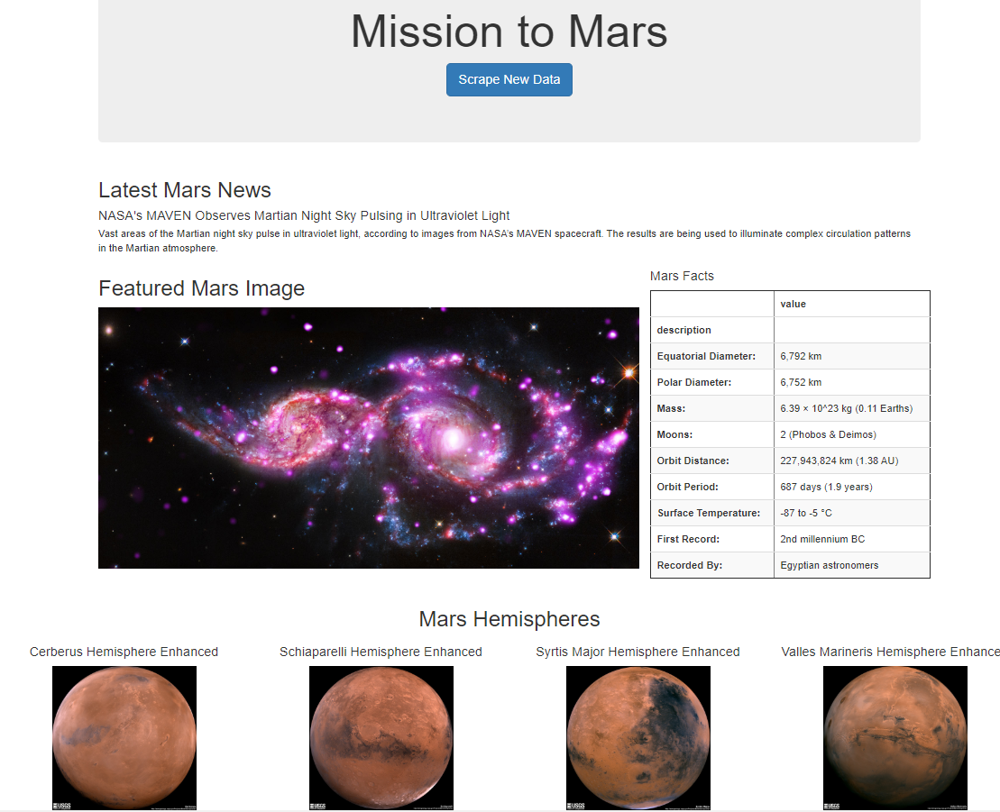

# Mission-to-Mars
Web scraping data about the next Mission to Mars  
---

##### Mars web page with scraped data

### Resources  
'https://mars.nasa.gov/news/'  
'https://www.jpl.nasa.gov/spaceimages/?search=&category=Mars'  
'http://space-facts.com/mars/'  
'https://astrogeology.usgs.gov/search/results?q=hemisphere+enhanced&k1=target&v1=Mars'  

# Portfolio example  
---

(https://github.com/TrentBrunson/Portfolio.git)
